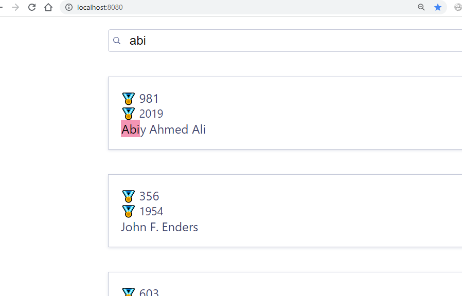
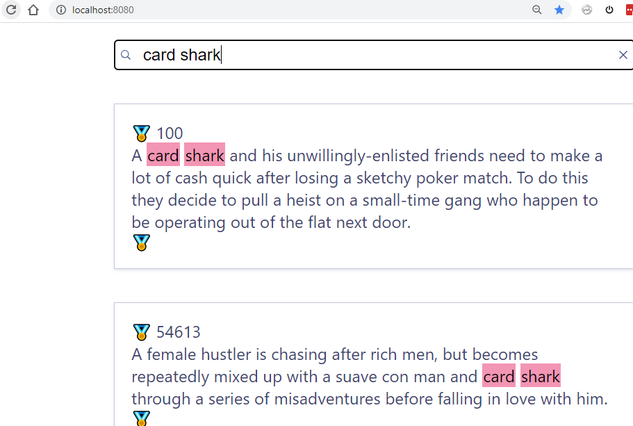

# MeiliSearch 文本搜索（如语料库、字典、个人笔记等）初学者模板
（基于`meilisearch-vue`的`example/nobel-prizes`）

## 使用

*   下载库及安装包
    ```bash
    git clone https://github.com/ffreemt/meilisearch-plaintext.git
    cd meilisearch-plaintext
    yarn  # 或 npm install
    ```

*   测试运行
    ```bash
    yarn serve
    ```

浏览 `http://localhost:8000/` 搜索`abi`

[]()

## 搜索自己的`meilisearch`库

 （如何建`meilisearch`库请参看[`meilisearch`主页](https://www.meilisearch.com/)）

*   修改 `src/App.vue`第`42`行指向自己的库（参看第`41`行的例子）
*   修改 `src/App.vue`第`43`行（如未设`API_KEY`可不修改）
*   修改 `src/App.vue` 第`47`行(参看第`46`行的例子)
*   根据需要修改 `src/App.vue`第`12`行 (`attribute="id"`）及 第`15`行 (`attribute="overview"`），可删掉第`18-26`行

*   可选
修改`src/App.vue`的`<style>...</style>`

*   编译上线
    ```
    yarn build
    ```


# 启动 http 服务器
例如 `cd dist && python -m http.server`

搜索`card shark`
[]()